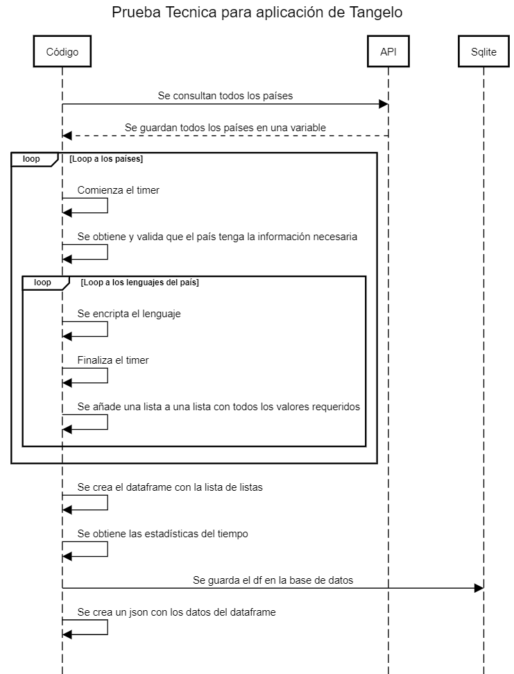

# tangeloApplication
Prueba Técnica -Tangelo-

## Prueba

|  Región | City Name |  Language  | Time  |
|---|---|---|---|
|  África | Angola  |  AF4F4762F9BD3FOF4A10CAF5B6E63DC4CE543724 | 0.23 ms  |
|   |   |   |   |
|   |   |   |   |

Desarrolle una aplicación en python que genere la tabla anterior teniendo las siguientes consideraciones:


- De https://restcountries.com/ obtenga el nombre del idioma que habla el país y encriptelo con SHA1 
- En la columna Time ponga el tiempo que tardó en armar la fila (debe ser automático)
- La tabla debe ser creada en un DataFrame con la librería PANDAS 
- Con funciones de la librería pandas muestre el tiempo total, el tiempo promedio, el tiempo mínimo y el máximo que tardo en procesar todas las filas de la tabla
- Guarde el resultado en sqlite
- Genere un Json de la tabla creada y guárdelo como data.json
- La prueba debe ser entregada en un repositorio git.


Es un plus si:

- No usa framework
- Entrega Test Unitarios
- Presenta un diseño de su solución

## Diseño de solución
Primeramente, decidí organizar el proyecto de la siguiente manera:
- *main.py*: el punto de entrada para correr el script
- *src/*
    - *config.py*: Variables de configuración
    - *database.py*: Donde se crea el modelo de la base de datos
    - *errors.py*: Donde se aloja la clase de error
    - *run.py*: Se encuentra la mayor parte de la lógica del proyecto
    - *tests.py*: Se encuentran los tests unitarios del proyecto
    - *utils.py*: Se encuentran funciones de apoyo

### Diagrama de Secuencia



### Obstáculos
El mayor obstáculo que se tuvo, fue tomar el timpo correcto de países que tenían más de un lenguaje, como por ejemplo Bélgica.


Por lo que se tuvo que crear un segundo "timer" que llevará el tiempo en lo que se tardo la solución antes de entrar al loop de los lenguajes.

## Instalación
Primeramente, será necesario clonar el repositorio y situarse sobre esa carpeta:
```
git clone https://github.com/ReneFernandoOM/tangeloApplication.git
cd tangeloApplication
```
Posteriormente, crear un ambiente virtual, activarlo e instalar las dependencias:
```
python -m venv .venv
source .venv/Scripts/activate
pip install -r requirements.txt
```

## Ejecución
Para ejecutar el proyecto, será necesario correr el archivo *main.py*
```
python main.py
```
Para ejecutar los tests, será necesario correr el archivo *tests.py* que se encuentra dentor de la carpeta *src*
```
python src/tests.py
```
